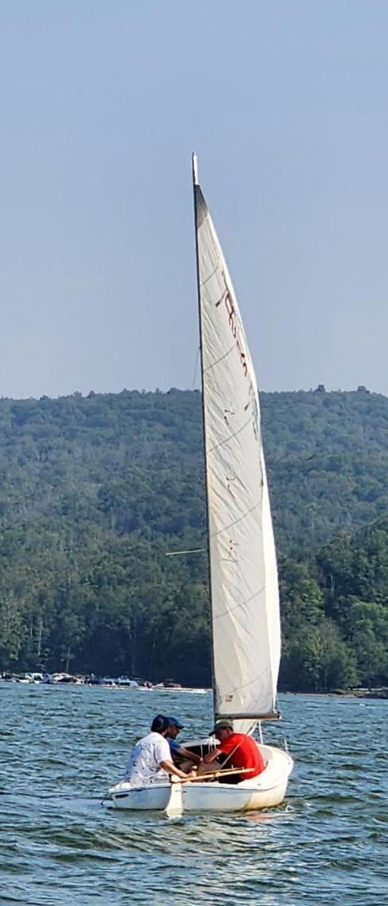

  

I am an astrophysicist at Columbia University broadly interested in galaxy evolution and the role that the large-scale structure of the universe plays in shaping the observed properties of galaxies. My work focuses on understanding how galaxies acquire, lose, and transform gas over cosmic time, and how the cosmic web influences these processes. I rely heavily on radio interferometry, particularly observations with the Very Large Array, to probe faint and extended gas structures that are difficult to detect. A major part of my research involves developing statistical and imaging techniques to identify subtle, low-surface-brightness signals and to trace how gas flows between galaxies and their environments.

In addition to my research, I am passionate about teaching and science communication. At Columbia University and Barnard College, I teach courses aimed at both STEM and non-STEM majors, including Life in the Universe, which uses the Drake Equation as an entry point to discuss astrobiology, planetary systems, and the search for extraterrestrial intelligence, and Frontiers of Science, a course designed to help students engage critically with the science they encounter in their everyday lives. I strive to create welcoming, curiosity-driven learning environments where students feel empowered regardless of background or preparation.

Outside of the academic world, I enjoy experimenting with new recipes (with wildly varying levels of success), exploring and enjoying New York City, and spending as much time as possible on the water sailing! When I’m not doing any of the above, you can probably find me moodily listening to music at a winery. If you’d like to chat about my work, opportunities, or anything related, please don’t hesitate to email me!

 
